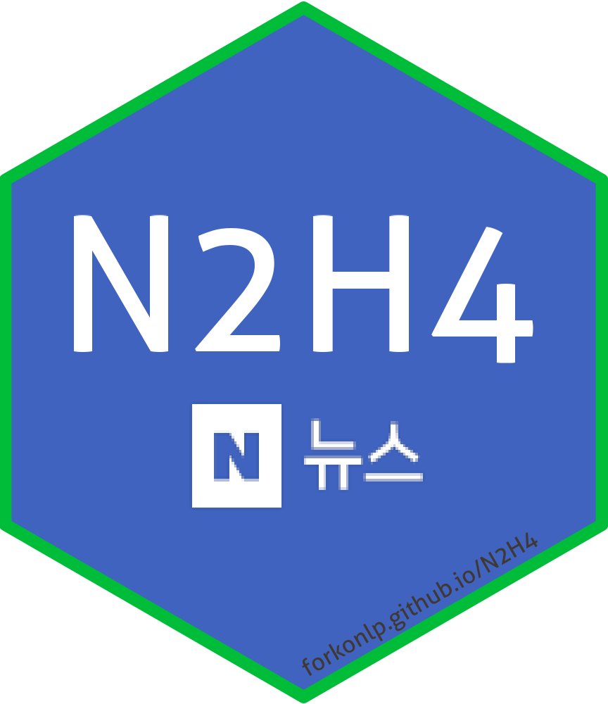

# N2H4 [](https://forkonlp.github.io/N2H4/index.html)

[](#contributors)
[](https://www.tidyverse.org/lifecycle/#maturing) 
[](https://opensource.org/licenses/mit-license.php) 
[](https://codecov.io/github/forkonlp/N2H4?branch=main) 
[](https://cran.r-project.org/package=N2H4)
[](https://forkonlp.r-universe.dev/)
[](https://forkonlp.r-universe.dev/ui#packages)
[](https://cran.r-project.org/package=N2H4)

## <https://forkonlp.github.io/N2H4/>

MIT 라이선스로 자유롭게 사용하셔도 좋으나 star는 제작자를 춤추게 합니다.    
Feel free to use under the MIT license, but stars make the owner happy.    

MIT 라이선스는 마음껏 쓰되, 출처를 표시해달라는 뜻입니다.    
It means you can freely use the MIT license, but please indicate the source when using it.    

사용하실 때 출처(링크 표기 가능)를 밝혀주시면 감사하겠습니다.    
Would be greatly appreciated if you could cite the source (link markable) when you use it.    

문의는 [이슈](https://github.com/forkonlp/N2H4/issues/new)로 남겨주세요.     
For any enquiries, please write through [Issue](https://github.com/forkonlp/N2H4/issues/new).    

[이슈](https://github.com/forkonlp/N2H4/issues)로 남겨주시면 같은 문제를 겪는 분이 해결하는데 도움이 됩니다.    
Writing through the [Issue](https://github.com/forkonlp/N2H4/issues/new), will help others who is experiencing the same problem.    
[디스코드](https://discord.gg/vbtUxnPXab)에 질문해주셔도 좋습니다.    
[Discord](https://discord.gg/vbtUxnPXab) is also available for any enquiries.    

## Installation

```r
# CRAN version
install.packages("N2H4")

# Dev version
install.packages("N2H4", repos = "https://forkonlp.r-universe.dev")
```

## Legacy installation

```r
install.packages("remotes")
remotes::install_version("N2H4", version = "0.8.4", repos = "https://cran.r-project.org")
```

More details: <https://forkonlp.github.io/N2H4/articles/install-legacy.html>

## Guides

- Korean README: <https://forkonlp.github.io/N2H4/articles/readmekr.html>
- Get content: <https://forkonlp.github.io/N2H4/articles/get-content.html>
- Get comments: <https://forkonlp.github.io/N2H4/articles/get-comment.html>
- Wiki migration - feature overview: <https://forkonlp.github.io/N2H4/articles/wiki-feature-overview.html>
- Wiki migration - category collection: <https://forkonlp.github.io/N2H4/articles/wiki-category-collection.html>
- Wiki migration - text collection: <https://forkonlp.github.io/N2H4/articles/wiki-text-collection.html>

## Environment variables

- `N2H4_CACHE`: controls whether cached category data is used in `getCategory()` / `news_category_get()` when `fresh = FALSE`.
  - truthy: `1`, `true`, `yes`, `on`
  - falsy: `0`, `false`, `no`, `off`

## Contributors

Thanks goes to these wonderful people ([emoji key](https://allcontributors.org/docs/en/emoji-key)):

<!-- ALL-CONTRIBUTORS-LIST:START - Do not remove or modify this section -->
<!-- prettier-ignore-start -->
<!-- markdownlint-disable -->
<table>
  <tr>
    <td align="center"><a href="https://github.com/LeeKwangHo"><br /><sub><b>leekw</b></sub></a><br /><a href="https://github.com/forkonlp/N2H4/issues?q=author%3ALeeKwangHo" title="Bug reports">🐛</a></td>
    <td align="center"><a href="https://github.com/yoonjaej"><br /><sub><b>yoonjaej</b></sub></a><br /><a href="https://github.com/forkonlp/N2H4/commits?author=yoonjaej" title="Code">💻</a> <a href="https://github.com/forkonlp/N2H4/issues?q=author%3Ayoonjaej" title="Bug reports">🐛</a></td>
    <td align="center"><a href="https://github.com/howdark"><br /><sub><b>howdark</b></sub></a><br /><a href="https://github.com/forkonlp/N2H4/issues?q=author%3Ahowdark" title="Bug reports">🐛</a> <a href="https://github.com/forkonlp/N2H4/commits?author=howdark" title="Documentation">📖</a></td>
    <td align="center"><a href="https://github.com/seokho92"><br /><sub><b>seokho92</b></sub></a><br /><a href="#ideas-seokho92" title="Ideas, Planning, & Feedback">🤔</a> <a href="https://github.com/forkonlp/N2H4/commits?author=seokho92" title="Code">💻</a></td>
    <td align="center"><a href="https://github.com/aerongss"><br /><sub><b>aerongss</b></sub></a><br /><a href="https://github.com/forkonlp/N2H4/issues?q=author%3Aaerongss" title="Bug reports">🐛</a></td>
    <td align="center"><a href="https://github.com/bbserverdown"><br /><sub><b>bbserverdown</b></sub></a><br /><a href="https://github.com/forkonlp/N2H4/issues?q=author%3Abbserverdown" title="Bug reports">🐛</a></td>
    <td align="center"><a href="https://github.com/RingPark"><br /><sub><b>RingPark</b></sub></a><br /><a href="https://github.com/forkonlp/N2H4/issues?q=author%3ARingPark" title="Bug reports">🐛</a></td>
  </tr>
</table>

<!-- markdownlint-restore -->
<!-- prettier-ignore-end -->

<!-- ALL-CONTRIBUTORS-LIST:END -->

This project follows the [all-contributors](https://github.com/all-contributors/all-contributors) specification. Contributions of any kind welcome!


## Stargazers over time

[](https://starchart.cc/forkonlp/N2H4)
